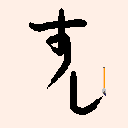
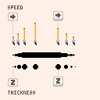
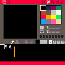
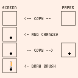

# Shodo

Ryosuke Mihara

I introduce a painting tool that I made with PICO-8, Shodo(書道). This is a demake of the 80’s Macintosh software, Mac書道(MacCalligraphy in U.S.) that simulates Japanese traditional ink-dipped brush calligraphy. Since you cannot use a mouse with PICO-8 when it runs a program, it may appear to be ridiculous to imitate brush drawings using only D-pad and an AB buttons. However, it can draw brush-like lines unexpectedly well.

In this article, I describe how to implement the brush-like line drawings, and the memory processing needed to make a painting tool.



## The brush movements

To draw lines that dynamically change their thickness, I added inertia to the brush. When you press an arrow key, the brush will move in the direction. When you release the key, the brush will gradually slow its speed, and then will stop. Pressing the Z button will cause the line to grow thick. The line will decrease its thickness after you release the button.
Operating these controls at the same time will allows you to draw brush-like lines.



## The memory processing

Painting tool must save its drawing data somewhere in the memory. Because the PICO-8’s screen resolution is 128 x 128, we need to find space to store 128 x 128 = 16,384 pixels. Although you may save these data in a Lua array, this is not recommended idea. I think that it will cause complications and run slowly. So, I use memset() and memcpy() . These PICO-8 API functions allow you to access continuous memories immediately.


### The space to save your picture

According to pico8.txt, memset() and memcpy() may only access the 32k memory area called "base ram.” The list below from pico8.txt describes the layout of the base ram.

```
    0x0    gfx
    0x1000 gfx2/map2 (shared)
    0x2000 map
    0x3000 gfx_props
    0x3100 song
    0x3200 sfx
    0x4300 user-defined
    0x5f00 draw state [,cart data] (192 bytes incl. unused)
    0x5fc0 (reserved for persistent data -- in development)
    0x6000 screen (8k)
```

The area that begins with 0x4300 is the "user-defined" area. That is what programmers can use freely. The area occupies 896 bytes (0x4300 to 0x5eff). Because the PICO-8’s color format is 2 pixels per byte, we need 16,384  / 2 = 8,192 bytes (4 kilobytes) of memory area to save all of the pixels on the screen. The user-defined area is not sufficient at all. So, I use the area from 0x1000 to 0x2 fff. This area is basically for sprites and maps copied from a cart. I don’t need it because Shodo uses just five sprites, and the first gfx area (from 0x0 to 0x0fff) has enough memory to store them.

The sprites used in Shodo:



### The screen updating

I named the 4k area from 0x1000 “paper area.” PICO-8 displays the pixel data in the "screen area" (beginning at 0x6000) to the screen. So, in order to display the user-drawn picture, we should just copy the data that is stored in the paper area to the screen area. The list below is the procedure to update the screen in the_draw() function which is called every 1/30 seconds. 

1.  Copy whole data in the paper area to the screen area (using memcpy())
2.  Add the changes made by the user to the screen
3.  Copy all of the data in the screen area to the paper area (using memcpy())
4.  Draw an image of a brush on the screen



In order to keep the only user-drawn content in the paper area, it is important to follow these instructions in the order in which they are listed.

The entire program appears below. It’s not very long or complicated. I didn’t implement any undo/redo functionality or eraser tool to respect the Japanese shodo tradition. However, it might be fun to add these things or a color palette.


